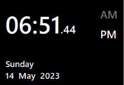

# rpi4-Smart-Mirror

This repositry is for **HTI** graduation project <br>
Project Grade: A+ <br>
Date: June 2023 

Generally, A smart mirror is a two-way mirror with an electronic display behind the glass. The display can show the viewer different kinds of information in the form of widgets, such as weather, time, date, and news updates.
## What does our Smart Mirror feature ?

<p align="center">
  
</p>

- **Time, Date, and Weather Display** : Users can quickly glance at the mirror to stay informed about the current weather conditions and plan their day accordingly.
- **Google Calendar Integration** : The smart mirror seamlessly integrates with the user's Google Calendar. It serves as a convenient visual reminder, ensuring that users never miss important engagements.
- **Gesture Control** : Users can interact with the smart mirror using hand gestures.
- **Smart Home Control** : The smart mirror acts as a control hub for other smart devices.
- **Facial Recognition** : The smart mirror incorporates facial recognition technology, allowing it to identify registered users.


## System Architecture
The system architecture is organized into the following layers:

1. [Software Modules Layer](#SoftwareModules)
    1. [Time & Date Module](#Module1)
    2. [Weather Module](#Module2)
    3. [Google Calendar Module](#Module3)
    4. [Ai Module](#Module4)
    5. [Smart Home Module](#Module5)
2. [Operating System Layer](#OSLayer)
    1. [Raspberry Pi OS](#RPiOS)
    2. [Yocto](#Yocto)
3. [Hardware Modules](#HardwareModules)
    1. [Raspberry Pi](#RPi)
    2. [Project Framing](#Framing)
    3. [ESP32](#ESP32)
        
<hr>

# Software Modules Layer <a name="SoftwareModules"></a>


## Time & Date Module
  <a name="Module1"></a>
  This module is used in the smart mirror to continuously update the time, date, and AM/PM labels, so that the smart mirror can display accurate and real-time information.
  <p align="center">
  
  </p>
  <hr>

## Weather Module
  <a name="Module2"></a>
  Weather module is designed to fetch weather data from [Openweathermap API](https://openweathermap.org/) and update its internal variables which store the weather information. 

  ### **`TODO`** :
  1. Sign up and obtain an API key : Visit [OpenWeatherMap](https://openweathermap.org/) and sign up for a free account. Once registered, you will receive an API key, which is needed in API requests for authentication.<br>
  2. In conf.h , Define the `OPENWEATHERMAP_API_KEY` macro value with your API key 

  <p align="center">
  
  </p>
  <hr>

## Google Calendar Module

  <a name="Module3"></a>
  This module enables you to access and display your Google Calendar events directly on the mirror's interface. The module utilizes the [Google Calendar API](https://developers.google.com/calendar/api/guides/overview) to fetch the user's calendar data, including event details.

  This module consists of two **submodules**:
  1. GCalendar python script: which is responsible for authentication, and fetching data from user's google calendar. 
  2. calendar qt c++ class : which is responsible for preparing and displaying fetched data to the user interface.
  <p align="center">
  <br>
  
  </p>

  ### **`TODO`** :
   To use the Google Calendar API to access and retrieve your events' details in your Python code, follow these steps:
   1. Set up a [Google Cloud project](https://console.cloud.google.com/) and enable the Calendar API.
   2. Create credentials (OAuth 2.0 client ID) for your project, and download the JSON file containing the credentials.
   3. Replace './Plugins/GCalendar/client_secret.json' content with your credintials. 
   4. Install the necessary dependencies
   ```
   pip install google-api-python-client
   pip install google-auth-oauthlib
   ```
   5. Run 
   ```
   cd ./Plugins/GCalendar/
   python3 GCapiDemo.py
   ```
   follow the given link, sign-in, and give permission to your google cloud project to access your google calendar info.

   Now, you should see your events details printed over the terminal. If you faced any problems, Or want a better understanding for your own customizations. Feel free to check this [tutorial](https://youtu.be/1JkKtGFnua8) by `Jie Jenn`.
   <hr>
 
## Ai Module

  <a name="Module4"></a>
  The AI module is a unit of code that uses machine learning algorithms to perform a specific task. It is integrated into the smart mirror system to provide AI capabilities, such as face recognition, and hand gesture prediction.

  **Submodules** <br>
  1. Facial Recognetion Model : You may check this Article: [Raspberry Pi Facial Recognition](https://www.tomshardware.com/how-to/raspberry-pi-facial-recognition) for further understanding.
  2. Hand Gesture Prediction Model : You may check this repo: [0-to-9-ASL](https://github.com/AladdinT/0-to-9-ASL) for further understanding.
  3. Inter Process Communcation using socket programming. 

  <p align="center">
  
  </p>


  Code Flow : 
  1. Snap current Frame using imutils.video.VideoStream
  2. If there is a hand pose, predict the gesture.
  3. If a face detected, predict the person.
  4. Send these data to the UI program to take actions.

  ### **`TODO`** :
  Install dependencies mentioned in each reference [Raspberry Pi Facial Recognition](https://www.tomshardware.com/how-to/raspberry-pi-facial-recognition) and [0-to-9-ASL](https://github.com/AladdinT/0-to-9-ASL).
  <hr>

## Smart Home Module

  <a name="Module5"></a>
  This module helps you integrate with other smart devices in the same home. In our case the ESP32 room controller. Which basically built to digitally control your room lights and fan.

  ### **`TODO`** :
  You need to either configure and burn smartHome.ino to your esp32. 
  You will need to configure the wifi SSD and Password.
  Or edit the Qt mainwindow.cpp to adapt interact with your other smart device accordingly.  
  <hr>

# Operating System Layer <a name="OSLayer"></a>

## Raspberry Pi OS buster
  <a name="RPiOS"></a>
  For this project Raspberry Pi OS Debian version: 10 (buster) was an ideal OS. Where we did not face any problems installing mediapipe library. Unlike other operating systems.
   
## Yocto Customized Image
 <a name="Yocto"></a>
  We have also created a custom Linux image using the Yocto Project tool to run the smart mirror application. A more detailed description of the layers and building process, Please check the following [readme_yocto.md](./readme_yocto.md).<br>
  However, We encountered a limitation where we couldn't find a suitable meta layer that allows the installation of the MediaPipe library, which is required for some of the AI functionality. As a result, the hand gesture control features using MediaPipe is not available in the current Yocto-based custom image.

  Please note that we are actively researching and working towards finding a solution to include the MediaPipe library in the Yocto Project environment. Any contributions or suggestions in this regard are highly appreciated.

# Hardware Layer <a name="HardwareModules"></a>

- ### Raspberry Pi 4 model b
   <a name="RPi"></a>
   Do not forget the attachments: Power supply, Micro HDMI Adapter, HDMI cable, MicroSD card, and Camera Module.

- ### Display Monitor
  <a name="Monitor"></a>
  For us, We used a traditional old PC monitor, Although I highly recommend you check this creative solution of [yt/DIYPerks](https://youtu.be/puFSdfIRNIw) that we intended to mimic but unfortunatly did not manage to.

- ### Project Framing
  <a name="Framing"></a>
  The framing consists of multiple layers that can be created using wooden material or using 3D printing. Feel free to have a closer look at the [3D design](https://app.vectary.com/p/4jbQw25FfEeVrmoh0F6Nvl)
  <p align="center">
   
  </p>
  <hr style="color: #00ff00;">
 
- ### Esp32
  <a name="ESP32"></a>
 